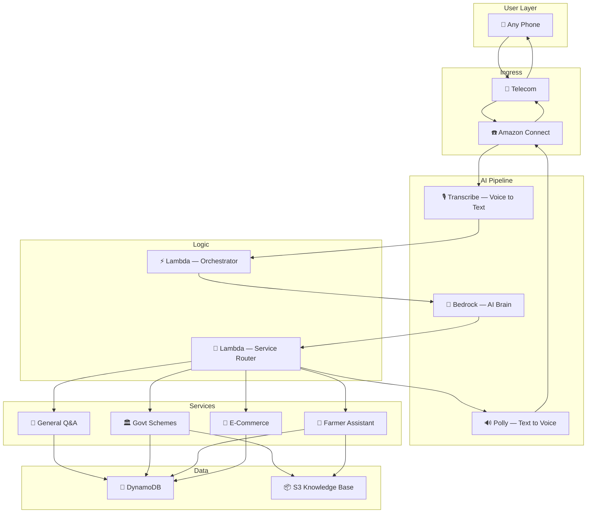

<div align="center">

# 🇮🇳 BharatVani — भारत वाणी

### *The Internet, Spoken.*

**A toll-free AI voice service that gives 700 million Indians access to digital services — using just a phone call.**

No smartphone. No internet. No app. No literacy. Just your voice.

---

[](https://aws.amazon.com)
[](https://aws.amazon.com/bedrock/)
[](#multilingual-support)
[](#the-problem)
[](#license)

[Requirements](./REQUIREMENTS.md) · [System Design](./DESIGN.md) · [Architecture](./ARCHITECTURE.md)

</div>

---

## 📞 One Phone Call. That's All It Takes.

```
👨‍🌾 Ramesh, farmer in Bihar, dials: 1800-BHARAT-VANI

🤖 AI:  "Namaste! BharatVani mein aapka swagat hai."

👨‍🌾 Ramesh: "PM-KISAN ke bare mein batao"

🤖 AI:  "PM-KISAN mein kisan ko saal mein 6000 rupaye milte hain,
         teen installments mein. Aadhaar aur bank account chahiye.
         Apply karne ke liye nearest CSC center jaayein."

👨‍🌾 Ramesh: "Aaj tamatar ka rate kya hai?"

🤖 AI:  "Delhi Azadpur mein 25 rupaye kilo,
         Mumbai Vashi mein 30 rupaye kilo."

👨‍🌾 Ramesh: "Dhanyavaad!"

🤖 AI:  "Shukriya! Kisi bhi samay dubara call karein."
```

**Ramesh didn't need a smartphone. Didn't need internet. Didn't even need to read.**
He just talked — and BharatVani did the rest.

---

## 🔴 The Problem

India's digital revolution has exploded — UPI, DigiLocker, UMANG, e-governance. But this revolution has a massive blind spot:

<div align="center">

### **700 million Indians are completely excluded from digital services.**

</div>

| Barrier | How Many Affected | Why Current Solutions Fail |
|---|---|---|
| **No Smartphone** | 700M have only feature phones | Apps require smartphones (₹6,000+) |
| **No Internet** | 350M+ lack reliable data | Websites need data plans (₹200+/month) |
| **No Literacy** | 260M adults not fully literate | All digital services require reading |
| **No English** | 500M+ don't understand English | Most apps default to English |
| **Age/Disability** | 140M elderly + 26M visually impaired | Touchscreens are inaccessible |

> **A farmer who wants to check PM-KISAN eligibility must travel 5 km, wait 2 hours in line, and lose ₹400 in wages — when the answer is just one phone call away.**

---

## 🟢 The Solution

**BharatVani = A toll-free phone number powered by AI.**

Any Indian can call and access **any digital service** through a natural voice conversation — in their own language.

```
┌────────────────────────────────────────────────────────────┐
│                                                            │
│   📱 Dial toll-free number from ANY phone (even ₹500)     │
│                          ↓                                 │
│   🤖 AI greets you in YOUR language (auto-detected)       │
│                          ↓                                 │
│   🗣️ Ask anything — in your own words, naturally          │
│                          ↓                                 │
│   🧠 AI understands → processes → responds with voice     │
│                          ↓                                 │
│   📩 SMS confirmation (for transactions)                   │
│                                                            │
│   ✅ No smartphone   ✅ No internet   ✅ No literacy       │
│   ✅ No app needed   ✅ Zero cost     ✅ Any language      │
│                                                            │
└────────────────────────────────────────────────────────────┘
```

---

## ✨ What BharatVani Can Do

| # | Capability | Example | Verification |
|---|---|---|---|
| 💬 | **Ask Anything** | "Bharat ki population kitni hai?" | None needed |
| 🏛️ | **Government Schemes** | "Ayushman Bharat mein kya milta hai?" | None needed |
| 🌾 | **Crop Prices & Weather** | "Aaj gehun ka rate kya hai?" | None needed |
| 🛒 | **Voice Shopping** | "Mujhe Samsung ka cover chahiye" | OTP verified |
| 🚂 | **Service Booking** | "Delhi se Patna train book karo" | OTP verified |
| 🆔 | **Aadhaar Services** | "Mera Aadhaar download karo" | OTP verified |

> **Information queries work instantly. Transactions are secured with OTP — spoken by voice, verified in seconds.**

---

## 🏗️ Architecture

BharatVani is built entirely on AWS — 10 services working together as a serverless AI pipeline.



### AWS Services Used

| Service | What It Does |
|---|---|
| **Amazon Connect** | Receives toll-free calls, routes audio |
| **Amazon Transcribe** | Converts speech → text in 22 Indian languages |
| **Amazon Bedrock** | AI brain (Claude 3.5 Sonnet) — understands intent, generates responses |
| **Amazon Polly** | Converts AI response → natural voice (Hindi neural voice: Aditi) |
| **AWS Lambda** | Serverless business logic — orchestrator, router, service modules |
| **Amazon DynamoDB** | Stores sessions, users, orders (single-digit ms latency) |
| **Amazon S3** | Knowledge base — government schemes, agriculture data |
| **Amazon SNS** | Sends OTP and confirmation SMS |
| **CloudWatch** | Monitoring, logging, alerting |
| **AWS IAM** | Service-to-service security |

---

## 🗣️ Multilingual Support

BharatVani auto-detects the user's language and responds in the same language.

| Language | Status | Population |
|---|---|---|
| 🟢 Hindi | Supported | 528M speakers |
| 🟢 English | Supported | 125M speakers |
| 🟡 Tamil | Phase 2 | 69M speakers |
| 🟡 Telugu | Phase 2 | 83M speakers |
| 🟡 Bengali | Phase 2 | 97M speakers |
| 🟡 Marathi | Phase 2 | 83M speakers |
| ⚪ 16 more languages | Planned | Remaining population |

**Code-mixing supported:** "Mujhe train ticket *book* karna hai" — AI understands Hindi-English mix naturally.

---

## 🔐 Security

| Action Type | Verification | Method |
|---|---|---|
| Information queries | ❌ Not required | Direct response |
| Transactions & orders | ✅ Required | 4-digit OTP via SMS |
| Sensitive data access | ✅ Required | OTP + caller ID verification |

- OTP expires in 5 minutes
- Max 3 attempts per session
- Sensitive data (Aadhaar, bank) is **never stored**
- All data encrypted at rest (AES-256) and in transit (TLS 1.2+)

---

## 📊 Impact

<div align="center">

| 700M | ₹10 Lakh Cr | 20+ Hours | ₹5,000 Cr |
|---|---|---|---|
| People gaining digital access | Govt scheme value made accessible | Saved per person per year | National savings from reduced travel |

</div>

### Government & UN Alignment

| National Mission | BharatVani's Role |
|---|---|
| 🇮🇳 **Digital India** | Extends digital access to the last 700M |
| 🌾 **PM-KISAN** | Farmers check eligibility & status by voice |
| 🏥 **Ayushman Bharat** | Health scheme access for all |
| ♿ **Accessible India** | Full digital access for persons with disabilities |

| UN SDG | Contribution |
|---|---|
| SDG 1: No Poverty | Access to financial inclusion schemes |
| SDG 9: Innovation | Novel voice-AI infrastructure |
| SDG 10: Reduced Inequalities | Bridges digital divide for 700M |

---

## 💰 Business Model

**Users pay ₹0.** Revenue comes from the supply side:

| Revenue Stream | Source | Projection |
|---|---|---|
| Government Subscription | ₹10/user/month from Digital India budget | ₹10 Cr/month at 1Cr users |
| Transaction Fees | ₹2/transaction paid by service providers | ₹20L/month at 10L bookings |
| Sponsored Services | Companies pay for rural reach | ₹2-5 Cr/month |

**Unit economics:** Cost per call = ₹1.45 | Revenue per call = ₹2-5 | **Profitable from Day 1.**

---

## 🏆 Why BharatVani Wins

<div align="center">

| What Others Build | What BharatVani Builds |
|---|---|
| Another app (needs smartphone) | Works **without any app** |
| Chatbot (needs internet) | Works on **voice call over 2G** |
| Website (needs literacy) | **100% voice-based** — zero reading |
| Serves existing users better | Serves **700M NEW users** |
| Incremental improvement | **Category creation** |

</div>

> **We're not competing with other apps. We're in a category of our own.**

---

## 📂 Repository Structure

```
BharatVani/
├── README.md                  ← You are here
├── REQUIREMENTS.md            ← Functional & non-functional requirements
├── DESIGN.md                  ← Detailed system design document
├── ARCHITECTURE.md            ← Technical architecture with diagrams
├── lambda/                    ← AWS Lambda functions
│   ├── orchestrator/          ← Main conversation orchestrator
│   ├── service-router/        ← Intent-based routing
│   ├── govt-schemes/          ← Government schemes module
│   ├── farmer-assistant/      ← Crop prices, weather, tips
│   └── ecommerce/             ← Voice shopping module
├── knowledge-base/            ← S3 data files
│   ├── schemes/               ← 30+ government scheme JSONs
│   ├── agriculture/           ← Farming knowledge base
│   └── products/              ← Demo product catalog
├── connect/                   ← Amazon Connect contact flows
├── demo-app/                  ← Live dashboard for demo
└── docs/                      ← Additional documentation
```

---

## 🚀 Getting Started

### Prerequisites

- AWS Account with access to: Connect, Bedrock, Transcribe, Polly, Lambda, DynamoDB, S3, SNS
- AWS CLI configured
- Node.js 18+ (for Lambda functions)
- Python 3.9+ (for data scripts)

### Quick Setup

```bash
# Clone the repository
git clone https://github.com/your-team/BharatVani.git
cd BharatVani

# Install dependencies
npm install

# Deploy infrastructure (AWS CDK)
cdk deploy --all

# Upload knowledge base to S3
aws s3 sync ./knowledge-base s3://bharatvani-knowledge-base/

# Test the system
npm test
```

---

## 🗓️ Roadmap

| Phase | Timeline | Milestones |
|---|---|---|
| **🏁 MVP** | Hackathon (48hrs) | General Q&A + Govt Schemes + E-Commerce Demo |
| **📈 Pilot** | Month 1-2 | 1 district pilot, 1,000 users, 6 languages |
| **🚀 Launch** | Month 3-4 | 3 states, 50,000 users, banking integration |
| **🌍 Scale** | Month 5-12 | Pan-India, 1 Cr+ users, govt partnership |

---

## 👥 Team BharatVani

| Role | Responsibilities |
|---|---|
| **Team Lead** | Strategy, live demo, presentation |
| **Technical Lead** | Core architecture, AWS integration |
| **AI/Voice Developer** | Bedrock, Transcribe, Polly pipeline |
| **Backend Developer** | Lambda functions, DynamoDB, API layer |
| **Presenter** | Pitch deck, demo script, judge Q&A |

---

## 📄 Documentation

| Document | Description |
|---|---|
| [**REQUIREMENTS.md**](./REQUIREMENTS.md) | Problem statement, functional/non-functional requirements, impact assessment |
| [**DESIGN.md**](./DESIGN.md) | System design, conversation engine, security, multilingual pipeline, demo app |
| [**ARCHITECTURE.md**](./ARCHITECTURE.md) | Technical architecture diagrams, data models, AWS service map |

---

<div align="center">

## 🇮🇳 *Har Phone, Har Bhasha, Har Bharatiya*

### Every Phone. Every Language. Every Indian.

**BharatVani gives 700 million Indians the internet they deserve — one phone call at a time.**

---

*Built with ❤️ for India | AI for Bharat Hackathon 2026*

*Powered by* **Amazon Web Services**

</div>
